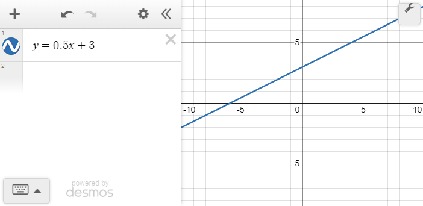
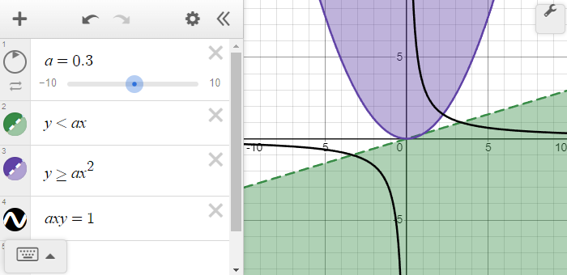
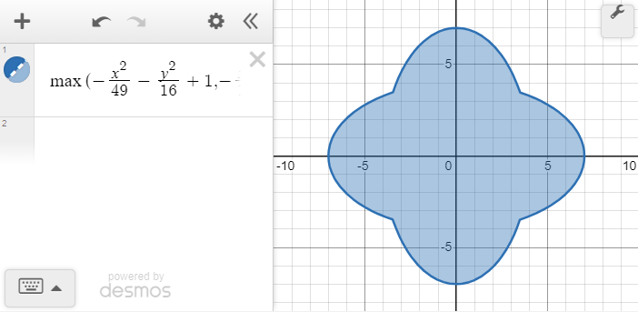
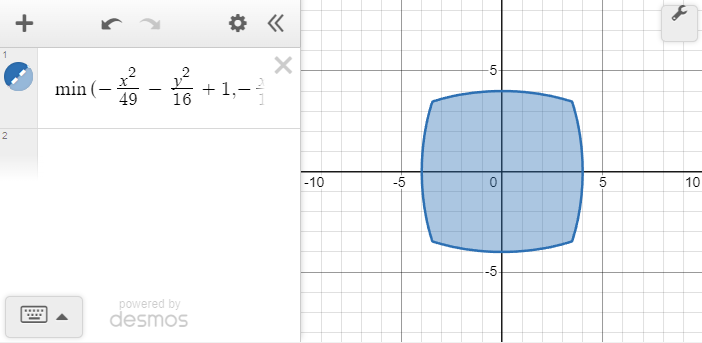
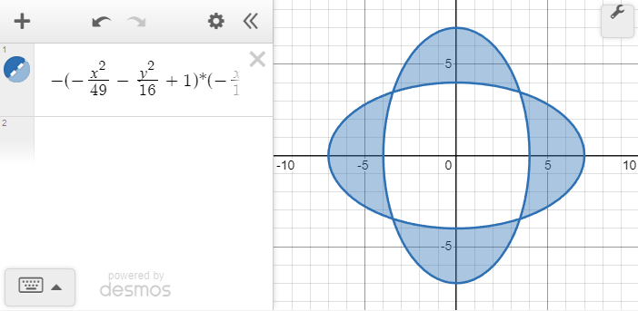

> [!NOTE]
> 
> [See a live view as a Jupyter notebook.](https://nbviewer.org/github/timdechant/desmospy/blob/main/README.ipynb)


<code>demospy</code> has these immediate goals:
  - present the Desmos API with consistent terminology
  - keep it simple, keep it pythonic

Basic usage is very simple.  Create an instance of <code>Calculator</code>, then assign to one of its members.

```python
from desmospy import Calculator

c = Calculator()
c.y = 1/2 * c.x + 3
c.show()
```

[](img/README_fig1.png)

More advanced plots can be created with comparisons and the <code>.define()</code> method:

```python
c.a = 0.3
a,x,y = c.a,c.x,c.y

c.define(y < a*x)
c.define(y >= a*x**2)
c.define(a*x*y == 1)
c.show()
```

[](img/README_fig2.png)

Equations and inequalities can also be combined; first let's define two ellipse regions.


```python
A = (x**2 / 49 + y**2 / 16 <= 1)
B = (x**2 / 16 + y**2 / 49 <= 1)
```

We can then take the union, also known as a logical OR <code>|</code> of the regions.


```python
c.define(A | B)
c.show()
```

[](img/README_fig3.png)

We can also take the intersection of the same regions, with the logical AND <code>&</code> operation.


```python
c.define(A & B)
c.show()
```

[](img/README_fig4.png)

This leaves the logical XOR <code>^</code> operation.


```python
c.define(A ^ B)
c.show()
```

[](img/README_fig5.png)
