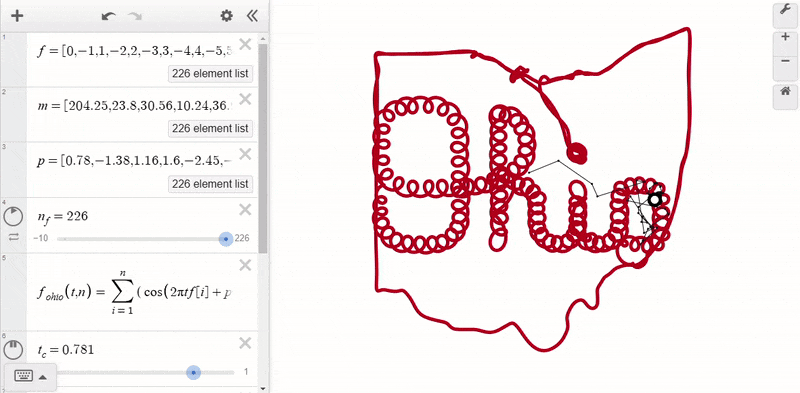

```python
!pip install 'desmospy>=0.0.5'
```

> [!NOTE]
>
> [Jump straight to the output *here*.](https://nbviewer.org/github/timdechant/desmospy/blob/main/examples/fourier-script-ohio/fourier-script-ohio.htm)
>
> [See a live view as a Jupyter notebook.](https://nbviewer.org/github/timdechant/desmospy/blob/main/examples/fourier-script-ohio/fourier-script-ohio.ipynb)
> 
> [See source code and more examples on github.](https://github.com/timdechant/desmospy)

# Python and Desmos

Python processing with Desmos interaction!  This shows the power of combining the two.

## Getting Started

Import the Calculator class from <code>desmospy</code> and create an instance.

<code>Calculator</code> takes one custom argument <code>size</code> to control the frame view; all other arguments are forwarded to the [Desmos API](https://www.desmos.com/api/v1.9/docs/index.html#document-calculator).


```python
from desmospy import Calculator
import numpy as np

calc = Calculator(size=(1200,600), showGrid=False, showXAxis=False, showYAxis=False)
```

Everything you need from desmospy is available using that <code>calc</code> object!

## Python Processing

We start by pulling in a CSV file containing a series of points.  This is then transformed into the frequency domain using a Fast Fourier Transform (FFT).


```python
j=(0+1j)

ohio = np.loadtxt('fourier-script-ohio.csv', skiprows=1, delimiter=",", dtype=float)

fft = np.fft.fft(ohio[:,0] + j*ohio[:,1])
fft = np.fft.fftshift(fft)

n = fft.shape[0]
mag = np.abs(fft/n)
phase = np.angle(fft)

fmax = (n-1)//2
freq = range(-fmax,fmax+1)

components = list(zip(freq,mag,phase))
components.sort(key=lambda fmp: abs(fmp[0]))
```

## Desmos Expressions

FFT converts the time-domain (or in our case, the 2D space domain) points into frequency components.

Each frequency component is define by three values: magnitude $m_i$, frequency $f_i$, and starting phase/angle $p_i$.

We will load these values into Desmos, then algebraically calculate the Inverse Fourier Transform:

$$
f(t) = \sum_{i=1}^{n} m_i \cdot \bigg(cos\big(2\pi \cdot t f_i + p_i\big) + j \cdot sin\big(2\pi \cdot t f_i + p_i\big)\bigg)
$$


```python
f_m_p = [ (f,round(m,2),round(p,2)) for f,m,p in components if m>0.01 ]
calc.f,calc.m,calc.p = zip(*f_m_p)
calc.n_f = len(f_m_p)

def unit_vector(theta):
    return calc.point(calc.cos(theta), calc.sin(theta))

@calc.function
def ohio(t, n):
    def component(i):
        return calc.m[i-1] * unit_vector(2*calc.pi * t*calc.f[i-1] + calc.p[i-1])
    return calc.sum(component, i=[1,n])

calc.t_c = 0
calc.f_scarlet = ohio(2*calc.range(1,10001)/10000, calc.n_f)
calc.f_gray = ohio(calc.t_c, calc.range(1,calc.n_f+1))
calc.f_dot = ohio(calc.t_c, calc.n_f)
```

Finally, we do a bit of formatting and display the results!


```python
calc.t_c.config(sliderBounds={'min': 0, 'max': 1}, playing=True) #, animationPeriod=80000, loopMode="LOOP_FORWARD")
calc.f_scarlet.config(points=False, lines=True, lineWidth=5, color="#BE0119")
calc.f_gray.config(points=True, pointSize=3, lines=True, lineWidth=1, color="#111111")
calc.f_dot.config(pointSize=20, pointStyle="OPEN", color="black")

calc.bounds(left=-50, right=350, bottom=-25, top=275)
calc.show(clear=False)
```


We <code>show</code>'ed that with <code>clear=False</code>, so calc remains fully intact.  [Let's save a second copy to an HTML file; see it *here*.](https://nbviewer.org/github/timdechant/desmospy/blob/main/examples/fourier-script-ohio/fourier-script-ohio.htm).


```python
calc.save('fourier-script-ohio.htm')
```
